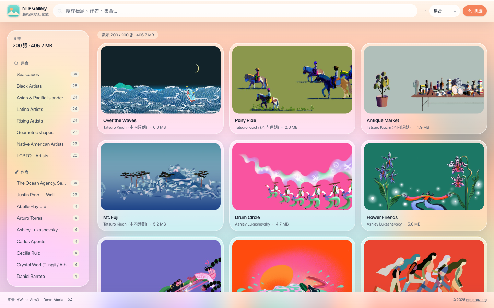

# NTP Gallery

Browse, search and fetch the wallpaper collections Google publishes through its
**Backdrop** service — 200 pieces of commissioned artwork across eight
collections, at up to 5120×2880.



## Why a sidecar

Backdrop exposes two endpoints:

```
POST https://clients3.google.com/cast/chromecast/home/wallpaper/collections
POST https://clients3.google.com/cast/chromecast/home/wallpaper/collection-images
```

Two things make them awkward to call from a page:

- The request bodies are protobuf. `?rt=j` flips the *response* to JSON (with a
  `)]}'` XSSI prefix), but the request still needs a hand-rolled message — one
  length-delimited string field, which `api/backdrop.py` encodes directly.
- Neither endpoint sends CORS headers, so a browser cannot reach them at all.

So a small stdlib-only Python sidecar proxies the API, downloads the images, and
serves the bytes. The React app talks only to `/api`.

## Run

```bash
pnpm install
pnpm dev            # sidecar on :8791 + Vite on :5188
```

Then open <http://localhost:5188>.

`pnpm dev:api` / `pnpm dev:web` run the halves separately.
`pnpm build && pnpm preview` serves the built bundle on :5189 with the same proxy
table. The sidecar port is 8791 because `*:8787` is a common default elsewhere;
override it with
`python3 api/server.py --port N` plus `NTP_API=http://127.0.0.1:N pnpm dev:web`.

## Features

### Browse

A lazy-loaded grid of 720px thumbnails generated with `sips`, so a library of 4K
originals stays responsive. Click any card for a full-resolution lightbox with
`←` / `→` navigation, `Esc` to close, and buttons to copy the file path,
download the original, or open the 5K source. Sort by collection, title, artist,
file size, or most recently added.

### Fetch

A side panel lists every remote collection with its local/remote count, a
1080p–5K size picker, live per-file progress, and a cancel button. Files already
on disk are skipped, so re-running a collection is cheap.

The button that opens it appears only when the address bar carries
`?begin=again` — see <http://localhost:5188/?begin=again>. That keeps a
destructive-ish control out of the way during ordinary browsing; it is **not**
access control, since `POST /api/fetch` stays reachable either way. Fetching is
also available from the CLI below.

### Categorise

Facet rails for collection and artist, each with counts. Both are multi-select
and combine with the search box.

### Search

Multi-term substring matching over title, artist, collection, path, and the
description line some collections carry. `/` focuses it from anywhere and `Esc`
leaves it.

### Look

One wallpaper is picked at random per visit and blurred behind the page, with
the surfaces above it rendered as liquid glass so the colour refracts through.
The footer credits whichever image was rolled and can reshuffle it, crossfading
rather than cutting.

Cards fade up every time they scroll into view — including on the way back —
driven by one shared IntersectionObserver rather than one per card. Drawers
slide, the lightbox scales, and controls that come and go collapse their width
or height instead of yanking the layout. All of it becomes static under
`prefers-reduced-motion`.

### Small screens

Below `sm` the header stays one row: the wordmark reduces to the favicon, and
the search field becomes a button that trades places with the action group when
tapped. Below `lg` the facet rail moves into a bottom sheet behind a filter
button, badged while any filter is active — the desktop rail and the sheet
render the same component, so they cannot drift apart.

## CLI

The web UI and the CLI drive the same engine.

```bash
python3 api/cli.py                      # list collections + local counts
python3 api/cli.py underwater           # fetch one
python3 api/cli.py all --size 5k        # fetch everything at 5120×2880
python3 api/cli.py --reindex            # backfill title/artist/source for stray files
python3 api/cli.py --fix-ext            # rename files whose extension ≠ their bytes
```

## Layout

```
api/
  backdrop.py   Backdrop client, download jobs, thumbnails, library index
  server.py     HTTP sidecar: /api/*, /images/*, /thumbs/*
  cli.py        headless front-end for the same engine
src/            React 19 + Tailwind 4 app
images/         wallpaper bytes                          (gitignored)
data/
  meta.json     title / artist / source URL per file     (committed)
  thumbs/       generated thumbnails                     (gitignored)
```

`images/` is gitignored — the full catalogue is 200 files, roughly 407 MB at 4K.
`data/meta.json` keeps every source URL, so a fresh clone plus one fetch
reproduces the library exactly.

## Notes

- **Backdrop mixes PNG and JPEG** (113 / 87 across the catalogue) and ignores
  the extension implied by the URL. Downloads are named from their magic
  bytes, and `--fix-ext` repairs anything an older run mislabelled.
- **Attribution arrives in three shapes.** Most collections give a separate
  artist line; Black Artists folds it into the title as `"<title> by <artist>"`,
  and Latino Artists as `"<artist>: <title>"`. `split_credit()` unpicks the
  latter two only when no artist was supplied and only when the candidate is
  name-shaped, so a title like `"I Want to Ride My Bicycle"` is left intact.
  Seascapes adds a third line, kept as `note` and included in search.
- Filenames can contain CJK — artist names such as `木内達朗` — so the sidecar
  percent-decodes request paths, before the traversal check rather than after,
  so an encoded `%2e%2e` cannot slip past it.
- Thumbnails use macOS `sips`. Without it the grid falls back to full-res images.
- The catalogue currently holds eight collections; the older Landscapes,
  Cityscapes and Art sets are no longer served. Backdrop also publishes a flat
  colour-swatch set, which is not artwork and carries no artist —
  `EXCLUDED_COLLECTIONS` in `api/backdrop.py` keeps it out of the catalogue so
  `all` never pulls it back in.
- Metadata writes are merged under one reentrant lock, so queueing several
  collections at once cannot make one job's entries clobber another's.
- The wallpapers are credited artist commissions. Fine as personal wallpaper —
  do not redistribute them.

## License

[MIT](LICENSE), covering the source in this repository (see [NOTICE](NOTICE)). It does not extend to
the artworks the tool fetches; each stays with the artist credited beside it,
and `images/` is gitignored precisely so this repository never carries them.
